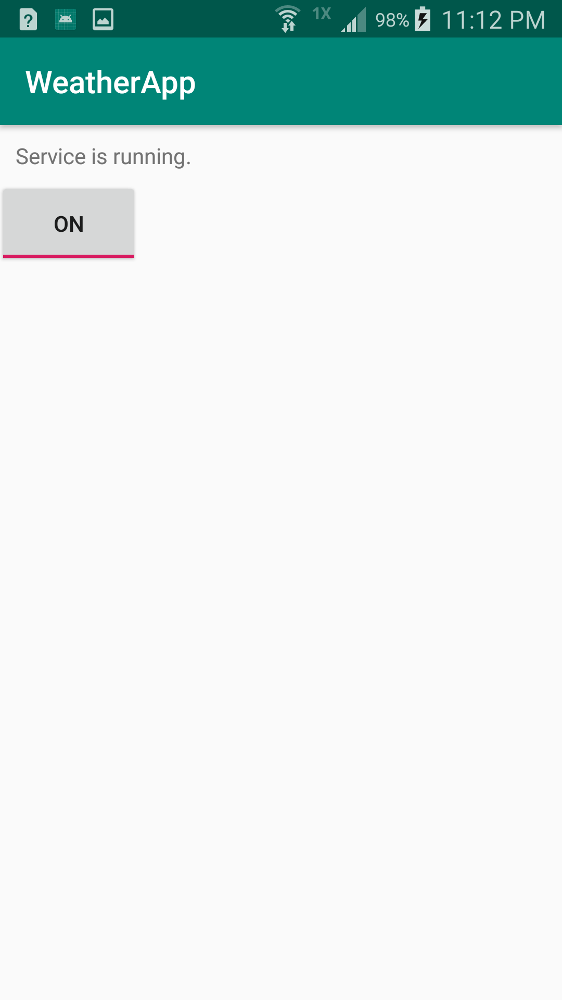
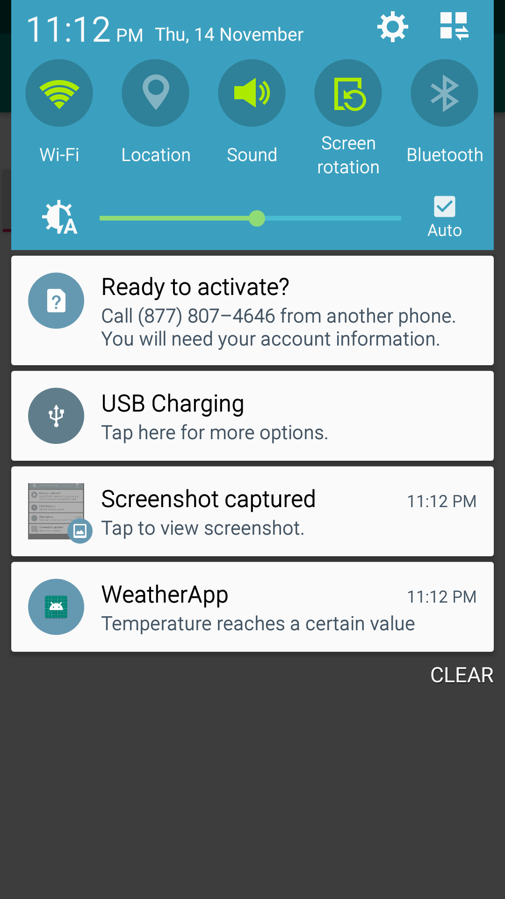

# WeatherApp
A basic weather app that is run in the background to check local weather periodically and notify the user when temperature is above some threshold.

This demo project uses the PeriodicUpdates template (available at https://github.com/huiannie/PeriodicUpdates) to implement weather checking. An online API access is required. This project uses the (currently free) service of OpenWeatherMap.org

### How to obtain an API key
To test this project, please register at https://home.openweathermap.org/users/sign_up and obtain an API key. Paste the API key in the SensorService.java file. 

## Basic Structure

This project consists of four classes:

### MainActivity

The MainActivity controls the setting of the sensor service. If the setting is ON, the service starts (or stay running). If the setting is OFF, the service is stopped. The setting is saved as a SharedPreference so that it is retrievable even when the activity no longer exists.

### SensorService

The SensorService periodically go online to download current weather data (using a TimerTask) as long as the service is running. If the service is killed, the service broadcasts a request for restart. While the service is running, it broadcasts a request to alert the user whenever the temperature exceeds a threshold value. 

### AlertReceiver

This receiver catches any alert broadcast from the SensorService. When such an alert is received, a notification is sent out.

### RestartReceiver

This receiver catches any restart broadcast from the SensorService. When such an alert is received, this receiver verify the setting in the SharedPreference. If the setting is ON, the service is restarted. Otherwise, the request is ignored.

## Screenshots
 
